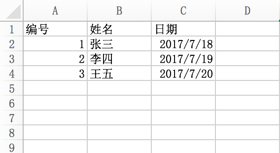

# Excel 处理

## 安装

```
composer require pfinal/excel
```

##  使用示例


### 导入Excel

```
<?php

include 'vendor/autoload.php'; // 如果在框架中通常不需要

use PFinal\Excel\Excel;

date_default_timezone_set('PRC');

$data = Excel::readExcelFile('./1.xlsx', ['id' => '编号', 'name' => '姓名', 'date' => '日期']);

//处理日期
array_walk($data, function (&$item) {
    $item['date'] = Excel::convertTime($item['date'], 'Y-m-d');
});

var_dump($data);

//如果数据量大，建议用csv格式
$data = Excel::readExcelFile('./1.csv', ['id' => '编号', 'name' => '姓名', 'date' => '日期'], 1, 1, '', 'GBK');

```

Excel中的数据:



得到结果如下:

```
$data = [
    ['id'=>1,'name'=>'张三', 'date'=>'2017-07-18'],
    ['id'=>1,'name'=>'李四', 'date'=>'2017-07-19'],
    ['id'=>1,'name'=>'王五', 'date'=>'2017-07-20'],
];
```

### 导出到Excel文件

```
$data = [
    ['id' => 1, 'name' => 'Jack', 'age' => 18, 'date'=>'2017-07-18'],
    ['id' => 2, 'name' => 'Mary', 'age' => 20, 'date'=>'2017-07-18'],
    ['id' => 3, 'name' => 'Ethan', 'age' => 34, 'date'=>'2017-07-18'],
];

$map = [
  'title'=>[
        'id' => '编号',
        'name' => '姓名',
        'age' => '年龄',
    ],
];

$file = 'user' . date('Y-m-d');

//浏览器直接下载
Excel::exportExcel($data, $map, $file, '用户信息');

//保存到磁盘文件中
//Excel::toExcelFile($data, $map, $file, '用户信息');


//分块导出到CSV文件 (如果中文乱码，输出为GBK字符集，将UTF-8改为GBK即可)
Excel::chunkExportCSV($map, './temp.csv', function ($writer) {

     DB::select('user')->orderBy('id')->chunk(100, function ($users) use ($writer) {
         /**  \Closure $writer */
         $writer($users);
     });
}, 'UTF-8');

```
